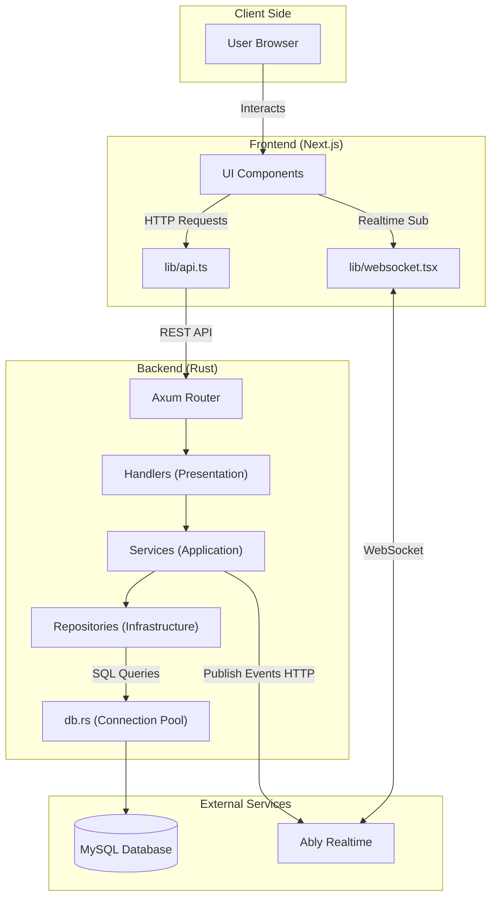

# System Architecture

This document outlines the high-level architecture of the application, including the frontend, backend, database, and external services.

## Architecture Diagram

## Component Details

### 1. Frontend (Next.js)
-   **Location**: `apps/web`
-   **Framework**: Next.js (React)
-   **Responsibilities**:
    -   Renders the user interface.
    -   Manages client-side state.
    -   Communicates with the backend via REST API (`lib/api.ts`).
    -   Subscribes to real-time updates via Ably (`lib/websocket.tsx`).

### 2. Backend (Rust)
-   **Location**: `apps/backend`
-   **Framework**: Axum
-   **Architecture**: Clean Architecture / Layered
    -   **Presentation Layer (`handlers/`)**: Handles HTTP requests, validates input, and calls services.
    -   **Application Layer (`services/`)**: Contains business logic (e.g., `session.rs`, `ably.rs`). Orchestrates data flow between handlers, repositories, and external services.
    -   **Infrastructure Layer (`repositories/`)**: Manages direct database interactions using `sqlx`.
-   **Database**: MySQL (managed via `sqlx` migrations and connection pool in `db.rs`).

### 3. External Services
-   **MySQL**: Relational database for persistent storage (Sessions, Users, etc.).
-   **Ably**: Real-time messaging service.
    -   **Backend**: Publishes events (e.g., `STATE_UPDATE`, `VOTE_UPDATE`) to Ably channels via REST API.
    -   **Frontend**: Subscribes to these channels to receive instant updates without polling.
